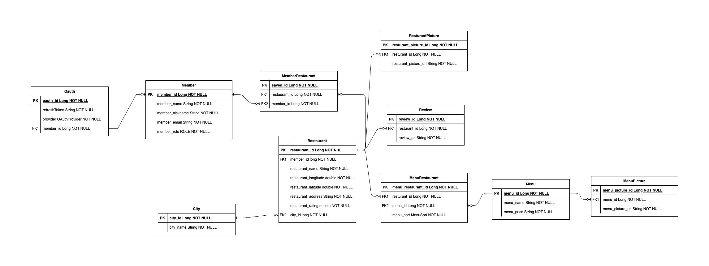

# Amaji

> AMAJI로 5행시를 만들어봤습니다.

Atmosphere of serenity,  
Mouth-watering sushi rolls,  
Authentic flavors from Ramen,  
Japanese restaurant at its best,  
Immerse in the experience.

> Japanese Restaurant!
---

## ERD

---

## API
### SWAGGER
TODO

---
## Tech spec
### Spring
- java 11
- Spring Boot 2.7.2
- Spring Data JPA
- QueryDSL
- Swagger

### DB
- h2 Database

### Test
- Assertion

